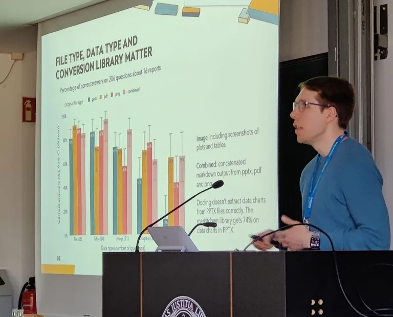
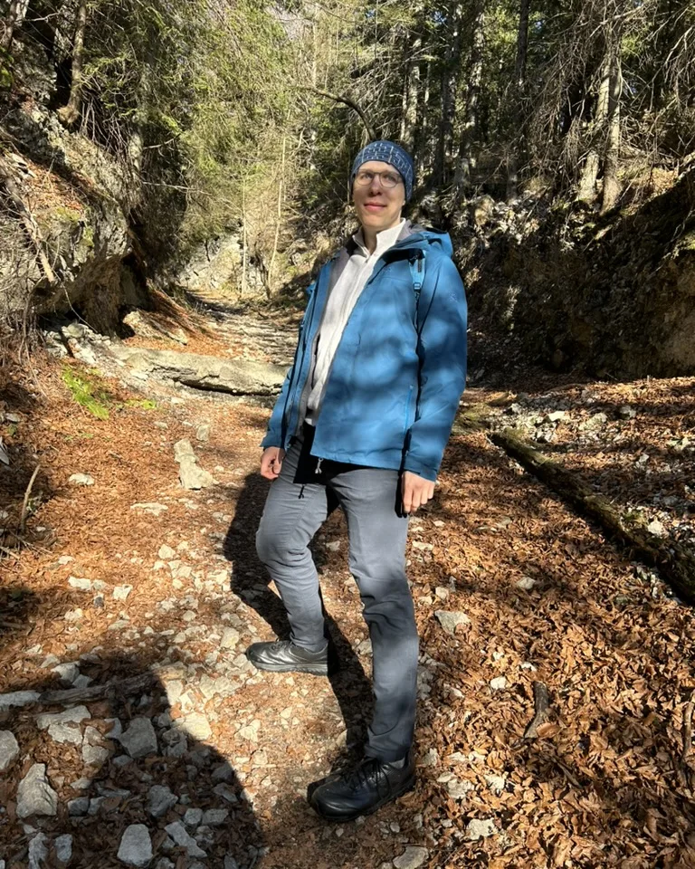
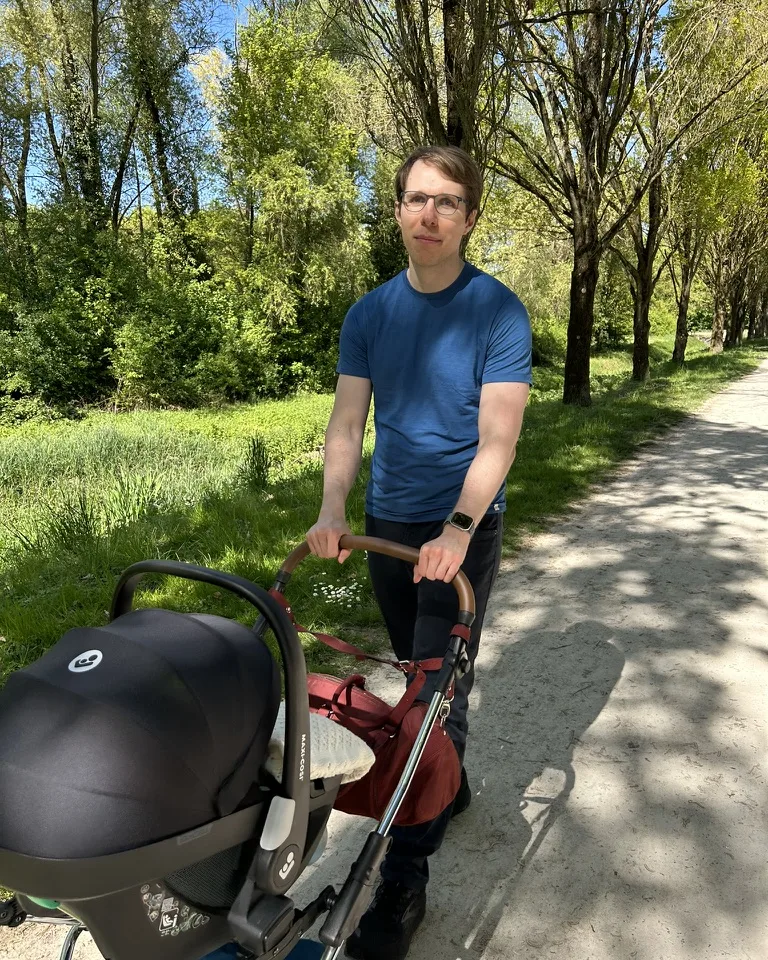
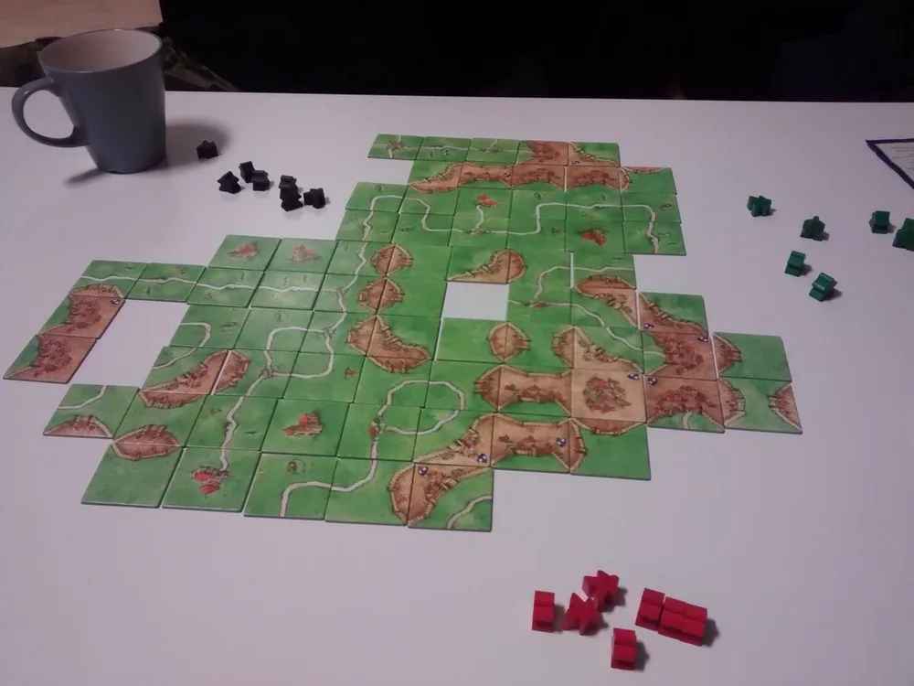

::: {.about-opening}

::: {.about-opening-copy}

Welcome to my website! I'm Paul Simmering, an AI Engineer from Germany.

### Work

I'm Lead AI Engineer at [Q Agentur für Forschung](https://teamq.de), a German market research agency. Using agentic AI, natural language processing and data engineering, I build tools and workflows to accelerate market research. My specialty is social media and sentiment analysis at scale. If your organization needs to understand consumer trends, market opportunities or sentiment towards a brand or product, I can help. Whether it's a report, a dashboard, a data pipeline or an MCP server, I can deliver the insights in a format that fits into your workflow or agent.

:::

:::

Previously, I was Technical Expert GenAI Platforms & Services at [LBBW](https://www.lbbw.de), the state bank of Baden-Württemberg. I was a developer on the GenAI team, building an enterprise-grade LLM chat application equipped with an agentic loop and tools to access internal data via RAG. In addition, I served as an internal consultant for GenAI initiatives.

Between 2018 and mid-2025, I worked in different roles at Q. My projects were for small and large businesses in consumer goods, pharmaceuticals, insurance and other industries. A large part of my work was productizing one-off projects into scalable data pipelines powered by languages models. Over seven years, I got to experience the evolution of language understanding from bag-of-words models to transformer models to large language models.

I hold a B.Sc. in Economics from the University of Mannheim and a M.Sc. in Economics from Aalborg University. Working on agent-based simulation models and Twitter data analysis during my studies sparked my decade-long interest in data science and AI.

::: {.cv-timeline}

::: {.cv-entry}
[2026 - present]{.cv-years}
[Lead AI Engineer]{.cv-title}  
[Q | Agentur für Forschung, remote]{.cv-org}
:::

::: {.cv-entry}
[2025 - 2026]{.cv-years}
[Technical Expert GenAI Platforms & Services]{.cv-title}  
[LBBW, Stuttgart]{.cv-org}
:::

::: {.cv-entry}
[2018 – 2025]{.cv-years}
[Data Analyst → Data Scientist → Senior Data Scientist]{.cv-title}  
[Q | Agentur für Forschung, Mannheim & remote]{.cv-org}
:::

::: {.cv-entry}
[2016 – 2018]{.cv-years}
[M.Sc. Innovation, Knowledge and Economic Dynamics (Economics)]{.cv-title}  
[Aalborg University]{.cv-org}
:::

::: {.cv-entry}
[2012 – 2015]{.cv-years}
[B.Sc. Economics]{.cv-title}  
[University of Mannheim]{.cv-org}
:::

:::

A more complete CV is available on my [LinkedIn profile](https://www.linkedin.com/in/paulsimmering/). You can see examples of my work in the [projects](/projects.html) section.

### Writing & speaking

::: {.about-public-layout}

::: {.about-public-copy}

On my [blog](/blog.html), I write about applied machine learning with a mix of technical articles, strategic insights and personal reflections. It's my practice of [learning in public](https://www.swyx.io/learn-in-public). I prefer blogging over social media because it allows for more depth, has better tools for code and interactivity, and lets authors stay in control of their content. It lacks the algorithmic discovery and engagement that social media platforms offer, but content can be found by search engines.

I also give [talks](/talks.html) at conferences and write [papers](/publications.html) on topics related to my work.

:::

:::

### Professional interests

- **Agentic AI**: From harnesses to MCP servers to the way we personally use AI, I'm deep in the rabbit hole of agentic systems. Evals & monitoring are the key actually replace human labor rather than just shifting it to review work.
- **Computational social science**: Imagine you could talk to a hundred thousand people at once and get a sense of what they think about a topic, their needs and pain points. Using natural language processing with the rigor of social science enables profound insights about what moves people.
- **Low-cost data engineering**: The separation of compute and storage, and the ability to use object storage as a data lake have made big data accessible to small businesses. Using tools like DuckDB, LanceDB and Polars, it's possible to build data pipelines that are both cheaper and more powerful than traditional data warehouses.
- **Data storytelling**: The best data is useless if it's not presented in a way that is understandable and actionable. I'm a big fan of Cole Nussbaumer Knaflic's [Storytelling with Data](https://www.storytellingwithdata.com) and curious about how AI can be used to bring aspects of it into automated report generation.
- **OSINT (Open-Source Intelligence)**: The internet offers a vast amount of data that could be used to enhance AI and business intelligence systems, such as news articles, social media posts, and more.

### Personal interests

::: {.about-personal-layout}

::: {.about-personal-copy}

- **Reading personal blogs**. Check my [blogroll](/blogroll.qmd) for recommendations of technical deep dives, lateral thinkers, and genuine personal reflections.
- **Economics**. While I've pivoted professionally, I'm still interested in public finance, regional development, pricing strategies and the intersection of sociology, psychology and economics.
- **Practical philosophy**. I keep a list of the [principles](/principles.qmd) that I find most useful for decision making and contentedness.
- **Parks and gardens**, especially [Japanese gardens](/japanese_gardens.qmd).
- **Board and card games**: Euro-style board games, Magic: The Gathering, Poker, Backgammon and other games that involve luck in a single game but are skill-based in the long run. I also like games involving trading and auctions, such as Power Grid and Bohnanza.
- **Video games**. Particular favorites are: Guild Wars, Baldurs Gate 3, Satisfactory, the Hitman series and the Dark Souls series. Playing a trader in EVE Online as a teenager drew me to economics and programming.

:::

:::

### What I use

I enjoy reading "what I use" lists of others, so here's mine: [What I use](/uses.qmd).  More details about the website itself can be found in the [colophon](/colophon.html).

### Contact

If you find the topics I mentioned above interesting, I would enjoy hearing from you. The best way to contact me is via email: [paul@simmering.dev](mailto:paul@simmering.dev).
