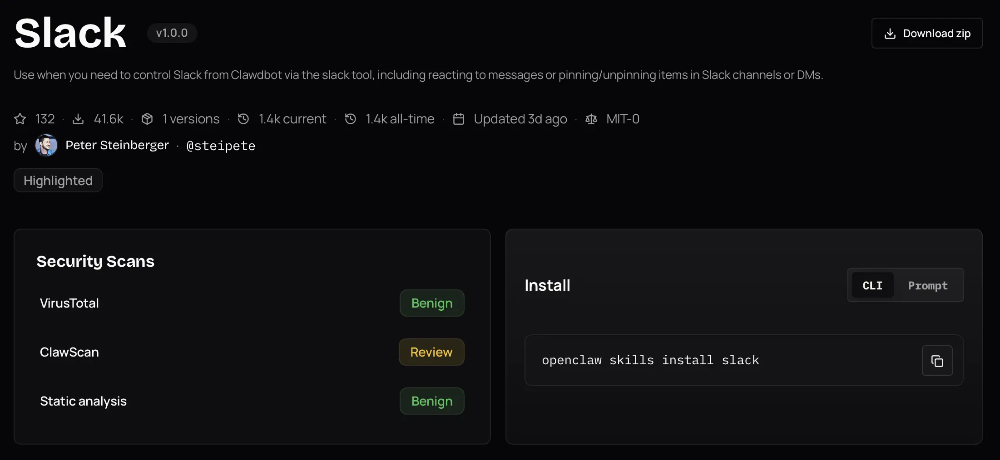

If the model is the brain of the agent, connections to APIs, databases and apps are the arms. There are many ways to connect the arms to the agent: tools, Model Context Protocol (MCP), the Agent to Agent (A2A) protocol, command line interfaces (CLI), skills, a code interpreter and computer use (mouse and keyboard input).

## Characteristics

In this article, I'll compare these connectors based on the following characteristics:

1. **Ease of authoring**: How much work is required to create, package, deploy and maintain a useful connector.
2. **Expressiveness**: The ability to run complex workflows and chain multiple tools and other agents. An expressive connector minimizes the number of model inference calls for a given task. For example, a model that needs to run five tools could either do five separate inference calls, or write a script that runs them in sequence.
3. **Token efficiency**: Minimize the number of input and output tokens involved in understanding and using the connector.
4. **Scalability**: How many connectors can be added without significant increases in error rate.
5. **Portability**: Whether it's possible to use the same connector with different agents and harnesses.
6. **Ecosystem**: The availability of integrations, libraries, examples, and support.
7. **Observability**: Quality of tooling to trace, debug and audit how the connector is used.
8. **Security**: Permissions needed to run the connector, whether it supports asking for user approval before taking actions, and how authentication with other systems works.

## Connectors

In all cases an agent harness (in its simplest form a loop prompting the LLM and executing its response) sits between the LLM and the outside world. The diagrams below leave the harness implicit and focus on what's distinctive to each connector.

### Tools

*DIY from start to finish*

```{mermaid}
graph LR
    Prompt[Prompt including tool definitions] --> LLM
    LLM -->|tool call| Tool[Local function or provider API]
    Tool -->|result| LLM
```

Tools are function definitions and configurations that are passed directly to the model along with the prompt. The model can output a structured response with the function's arguments. Now, there are two ways to execute the tool: either the client passes the arguments to a local function, or the API provider executes it inside the API. An example of the latter is OpenAI's web search tool in the Responses API.

Tools, especially when executed by the client, are the most customizable approach. You have full control over the definitions and executions. Authoring a tool isn't hard: you write a function, e.g. in Python or TypeScript, and pass it to a `tools` parameter in a request to the model. The more difficult part is making sure the agent understands your tool, which is a context engineering problem.

If you're using more than a few tools, *tool search* or other logic becomes necessary to avoid bloating the context window. An example of this is [Pydantic AI's tool search](https://pydantic.dev/docs/ai/tools-toolsets/tools-advanced/#tool-search). You can also write your own logic to control which tools are available at each chat turn. This can act as a system to hide irrelevant tools to save tokens or it can encode state: for example, a data analysis agent might first see tools to list and filter datasets, pick a dataset and only then see tools to analyze it. This logic can be powerful, but it lives inside of your custom harness rather than a reusable connector. Another downside is that hiding tools runs the risk of the agent missing opportunities to use them.

The biggest con of tools is that they are hard to reuse. Let's say I write a tool to work with an agent that I have built with Pydantic AI. I can't just take that tool and let a Cursor agent use it. MCP, the next connector, solves this by turning tools into shared servers.

**Main use case**: custom tools with maximum control.

### MCP: Model Context Protocol

*The USB-C port for agents* -- Anthropic

```{mermaid}
graph LR
    Config[mcp.json] --> LLM
    LLM <-->|JSON-RPC| Server[MCP server]
    Server <--> Backend[Backend API]
```

MCP servers are essentially shared versions of tools: instead of defining functions inside one harness, you expose them through a reusable server. This server can run locally or remotely. In addition to tools, MCP supports prompts and resources (data sources), but those are rarely used. MCP servers can be shared privately within organizations and publicly at [https://registry.modelcontextprotocol.io](https://registry.modelcontextprotocol.io) and other MCP registries.

Almost every major SaaS product has an MCP server, letting agents connect without writing custom code. Not all of those are well designed; many are simple wrappers around existing APIs. In particular, they are not token-efficient in their descriptions and require multiple calls to get something done, each of which is an inference call to the LLM. As a consumer of the MCP server, you can't change the tool names or descriptions.

Security is decent for trusted, least-privilege servers, but approval gates are mainly a client responsibility and tool descriptions, schemas and outputs are prompt-injection surfaces.

Adding too many MCP servers or servers with too many tools bloats the context window. As an example, the official GitHub MCP server exposes 94 tools consuming 17,600 tokens ([source](https://github.com/atlassian-labs/mcp-compressor/tree/v0.13.0#why)). So just writing "hi" to an agent using that server will cost 17,601 input tokens, plus the cost of the response. To avoid this, Anthropic  came up with [tool search](https://www.anthropic.com/engineering/advanced-tool-use), which exposes a tool search tool instead of the full tool set. So when you write "hi", the agent doesn't even have to load the GitHub MCP tools, and if you ask it "why is CI failing" it can use search to find `list_workflow_runs` and `get_workflow_run` specifically rather than loading all 94 tools.

It's straightforward to create a local MCP server and doesn't take much more than creating a tool. Sharing it adds significantly more work for packaging, authentication, rate limiting, deployment and ongoing observation. 

**Main use case**: sharing tools across agents and connecting to remote services.

### A2A: Agent to Agent Protocol

*Agent collaboration in full fidelity*

```{mermaid}
sequenceDiagram
    participant AgentA as Agent A
    participant AgentB as Agent B
    participant Own as Own tools / skills / MCP

    AgentA->>AgentB: discover agent card
    AgentA->>AgentB: task
    AgentB->>Own: use tools / skills / MCP
    Own-->>AgentB: result
    AgentB-->>AgentA: response
```

A2A connects agents with each other. Each agent has an agent card that describes its capabilities. Another agent discovers the card and can delegate tasks to the agent. The executing agent uses its own tools, skills, MCP servers or any other capabilities and reports back to the delegating agent. The difference to packaging an agent as a tool is that A2A treats the executing agent as a stateful remote collaborator. This unlocks multi-turn interaction (e.g. asking for more information) and long running tasks with task IDs and lifecycle states such as `working`, `completed` or `failed`. How the executing agent uses its own capabilities is not shared with the delegating agent. Internal logic is not shared. The agents can run in different environments, using different LLMs and harnesses and be controlled by different organizations.

A2A is not a replacement for MCP, it adds a new dimension above it. It's a powerful solution that promises maximum expressiveness, token efficiency and scalability from the perspective of the delegating agent. But A2A hasn't taken off like MCP. One explanation is that exposing an agent is more involved than exposing a tool: agents are not deterministic, continuously consume tokens, are stateful, and can't be versioned as easily as an MCP server that's a front to an API. In addition the frontend support is still limited. Most common agent harnesses and chat apps people actually use, including ChatGPT, Claude, Claude Code, Codex and Cursor, don't expose A2A endpoints. Others, like Microsoft Copilot Studio and LangDock support it. In contrast, all of them support MCP.

**Main use case**: multi-turn interaction between agents

### CLI: Command Line Interface

*The best agent architecture is already sitting in your terminal* -- Ashka Stephen

```{mermaid}
graph LR
    User -->|"use the XYZ CLI"| LLM
    LLM -->|bash command| Shell
    Shell -->|stdout| LLM
```

The typical training material for LLMs contains a lot of examples of using CLIs and writing bash commands. So LLMs are already proficient with standard bash commands and CLIs out of the box, for example `grep`, `git`, `curl`, `uv`, `docker` and `psql`. This gives agents access to a huge existing software ecosystem without agent-specific integration work and with optimal token efficiency. It's also expressive: shell commands can be piped into each other. Here's an example that combines the `git log` command with bash built-in commands to count commits by author:

```bash
git log --format='%an' | sort | uniq -c | sort -nr
```

The tradeoff is security. To use CLIs directly, the LLM needs shell access, which by default gives it access to the entire host system. Granular approval is hard because there are countless commands, and they can be composed in unexpected ways. The solution is to sandbox the agent's shell, only giving it access to files that it needs to complete the task. Another option is to emulate the shell, as done by Vercel's [just-bash](https://github.com/vercel-labs/just-bash).

Naturally, the CLI ecosystem centers on software development, cloud and system administration tools. Outside of these domains, there are fewer CLIs to reuse, though [Data Science at the Command Line](https://jeroenjanssens.com/dsatcl/list-of-command-line-tools.html) show how far standard unix utilities can go for data analysis. For example, `awk` can extract columns and compute aggregations from text streams, while `jq` can filter and reshape JSON from API. These tools can also be used for RAG, as shown in an article by [Vercel](https://vercel.com/blog/how-to-build-agents-with-filesystems-and-bash).

**Main use case**: using developer, sysadmin and unix tools with an agent that has shell access

### Skills

*Loose prompt and script bundles with built-in tool search*

```{mermaid}
graph LR
    Skill[SKILL.md] -->|name + description upfront| LLM
    LLM -->|load full SKILL.md on demand| Skill
    LLM -->|run script| Scripts[Scripts / resources]
    Scripts -->|result| LLM
```

Skills are CLI plus a prompt template. They have built-in tool search: each skill is a directory with a `SKILL.md` file and optional scripts/resources.  A minimal `SKILL.md` example, featuring YAML frontmatter and a script:

````markdown
---
name: word-count
description: Count words in a text file. Use when the user asks for a word count.
---

Run `python scripts/count.py <path>` and report the total.
````

The scripts are any code that can be executed by a shell, for example a Python script. `SKILL.md` is a Markdown file with a name and description, and optional scripts/resources. In addition to providing the script arguments, skills can also function as a prompt that describes how to use multiple scripts in a workflow.

This low ceremony is a large part of their appeal: a useful skill can be just a Markdown file plus optional scripts. In addition, skills have built-in progressive disclosure for token efficiency: the LLM gets the skill name and description upfront, and loads the full skill content on demand. While skills were originally invented by Anthropic to be used with Claude, the biggest registry is [ClawHub](https://clawhub.ai) for OpenClaw agents, featuring over 3000 skills. By now, skills work with most CLI agents and IDEs, but not with apps like ChatGPT.



The limits show up when the workflow gets bigger: skill results can't be chained directly, scripts need to be packaged as CLI tools, and the pattern is a poor fit for very large tool sets or remote execution. Security-wise, skills inherit the same shell access risk as CLI. They can make it worse by adding a supply-chain surface: users may install skills from registries without fully auditing them. In February 2026,[Snyk](https://snyk.io/blog/toxicskills-malicious-ai-agent-skills-clawhub/) found 76 malicious skills employing prompt injection and other techniques on ClawHub and found critical vulnerabilities in 13% of all skills.

**Main use case**: simple, discoverable connector bundles for local agents.

### Code

*Build your own tools on the fly*

```{mermaid}
graph LR
    Agent -->|"write code"| Code
    Code -->|"type check"| TypeChecker[Type checker]
    TypeChecker -->|"feedback"| Agent
    Agent -->|"run code"| Code
    Code -->|"result"| Agent
```

Code is CLI taken further: instead of only running existing commands, the agent writes a small program for the task. This approach is the most expressive, letting the agent write whole programs in a single turn of the conversation. It taps into the vast software engineering ecosystem: LLM pretraining and reinforcement learning on coding problems, code editors, type checkers, linters, test runners and all of the tools that developers use to build software. But its usefulness isn't limited to software development - for instance, Claude Cowork creates PowerPoint files by writing a Python script that defines slides using python-pptx and runs it.

Writing code is easy for the model, but securely running arbitrary code requires a sandbox, dependency controls and permission boundaries. User approvals are even more difficult than for CLI tools because it can write arbitrary code rather than execute predefined commands. Users who are not developers can't judge the safety and correctness of the code.

**Main use case**: coding agents, with apps like Claude Cowork exploring the potential for general purpose agents.

### Computer Use

*When there is no API*

Many apps lack an API. In these cases, the agent can simulate mouse clicks and keyboard inputs to interact with the app. The agent receives a representation of the UI, which can be a screenshot, an accesibility tree (used by screen readers), or a simplified browser DOM.

```{mermaid}
graph LR
    App[App State] -->|"representation"| Agent
    Agent -->|"mouse and keyboard input"| App
```

The agent can interact with any app, which creates a magic "the agent uses my computer like I do" experience. Computer use has universal reach across websites, web apps and desktop apps, but not a reusable connector ecosystem. Each UI is a fresh comprehension and control problem. 

Frontier models have become increasingly capable. The benchmark [*OSWorld-Verified*](https://os-world.github.io/) measures whether agents can complete real desktop tasks across apps. Humans complete 72.4% of tasks, while GPT-5.5 and Opus 4.7 manage 78.0% and 78.7% respectively.

The downside of computer use is that the full app or browser needs to be running, and token usage is high especially when screenshots are involved. In addition, a 78% score is still far from perfect. The agent relies on a secondary representation that wasn't made for agents, and the pattern doesn't scale well to multiple apps. Another difficulty is handling secrets: an agent with access to a password manager could accidentally paste credentials into a wrong field.

**Main use case**: interacting with apps that lack an API.

## Comparison

The following table summarizes the comparison on a simple scale that naturally omits details: green means the connector performs well on the characteristic, yellow means it performs well enough, red means it performs poorly.

```{=html}
<style>
.comparison-table table {
    table-layout: fixed;
    width: 100%;
}

.comparison-table th:first-child,
.comparison-table td:first-child {
    width: 16%;
}

.comparison-table th:not(:first-child),
.comparison-table td:not(:first-child) {
    text-align: center;
    width: 12%;
}
</style>
```

::: {.comparison-table}
| Characteristic | Tools | MCP | A2A | CLI | Skills | Code | Computer Use |
|---|---|---|---|---|---|---|---|
| Ease of authoring | 🟢 | 🟡 | 🔴 | 🟡 | 🟢 | ⚪ | 🟢 |
| Expressiveness | 🟡 | 🟡 | 🟢 | 🟢 | 🟡 | 🟢 | 🟡 |
| Token efficiency | 🟡 | 🟡 | 🟢 | 🟢 | 🟢 | 🟢 | 🔴 |
| Scalability | 🟡 | 🟡 | 🟢 | 🟡 | 🟡 | 🟢 | 🔴 |
| Portability | 🔴 | 🟢 | 🟡 | 🟡 | 🟡 | 🟡 | 🔴 |
| Ecosystem | 🟡 | 🟢 | 🔴 | 🟢 | 🟢 | 🟢 | 🔴 |
| Observability | 🟢 | 🟢 | 🟡 | 🟡 | 🟡 | 🟡 | 🔴 |
| Security | 🟢 | 🟡 | 🟡 | 🔴 | 🔴 | 🔴 | 🔴 |
:::

This assumes that connectors are generally well specified and that tool search is used for the Tools and MCP connectors. Ease of authoring doesn't apply well to the code connector.

### Conclusion

Each connector has a unique use case:

- **Tools**: custom tools with maximum control.
- **MCP**: sharing tools across agents.
- **A2A**: multi-turn interaction between agents.
- **CLI**: using developer, sysadmin and unix tools with an agent that has shell access.
- **Skills**: simple, discoverable connector bundles for local agents.
- **Code**: maximum expressiveness for coding agents and experimental general purpose agents.
- **Computer use**: interacting with apps that lack an API.

It's easy to wrap one and the same function as a tool, local MCP server or skill, so it's not a problem to change the representation of the connector later. Only use A2A for advanced multi-turn interaction between agents and check compatibility first. CLI, skills and code offer the fullest expressiveness, but require sandboxing. For now, I'd only recommend them for interactive use. Skills are deceptively simple but can be abused. Computer use scores worst in the table above, but is the only way to interact with apps that lack an API. 
