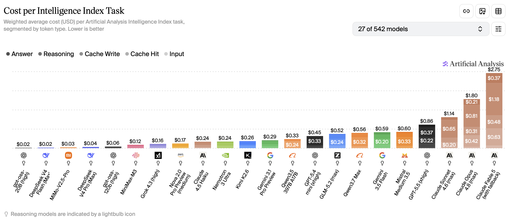
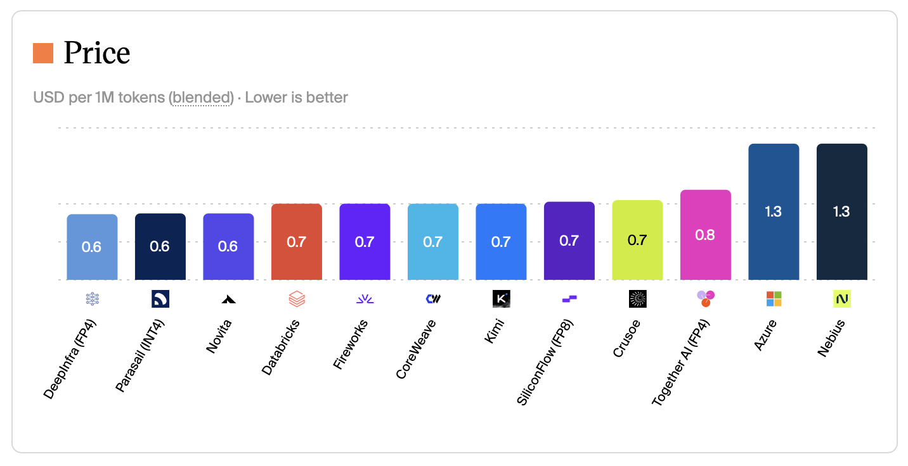
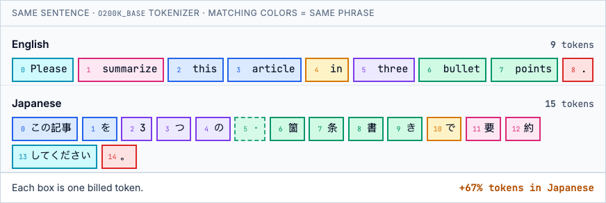

Not all of us are token billionaires. Costs for frontier model inference has been going up. For example, GPT-5.5 costs twice as much as GPT-5.4. This is a guide with 17 ways of reducing token costs. Each measure is accompanied by estimated savings and the trade-offs necessary to make it work. As you'll see, token costs can be reduced by 90% or more or be entirely free! The techniques are grouped into categories and ordered from simple to advanced within each group. Feel free to skip ahead using the table of contents.

## Pick cheaper inference

### Use the cheapest model that does the job

Savings: ~96%, when comparing GPT-5.4 nano to GPT-5.5 ($0.20/$1.25 vs $5.00/$30.00 per MTok (million tokens)).

For well-defined tasks, small models can be just as good as larger models. Don't use Opus when Haiku can do the job! Common tasks for small models include summarization, classification, translation and being sub-agents for larger models. If you're building an agentic workflow, you could use a different sized model for each step depending on complexity. For a chatbot, you could use a model router that picks an appropriate model for each request. Besides the price, some models are more token-efficient than others. They can give equally intelligent answers using fewer tokens. Artificial analysis combines price and token efficiency into a [cost per intelligence](https://artificialanalysis.ai/#price-and-cost) metric.



Trade-off: could underestimate the difficulty of the task and pick a model that isn't smart enough, which then needs multiple attempts or downright fails.

### Use the cheapest provider and region

Savings: up to 60% less. For example, Kimi K2.6 costs $1.30 per Mtok (blended cost at 7:2:1 cache-input-output) on Azure compared to $0.60 on Novita.

Check if a given model is available from other API providers or in a cheaper cloud region. This matters most for open weights models. Closed models tend to have identical prices across providers.



Trade-off: could be slower, data privacy concerns, cheaper providers may quantize more aggressively.

### Use batch inference

Savings: 50% of the request.

If you don't need the results immediately, you can send requests in a batch and poll for the results later. OpenAI, Anthropic, Google (Gemini), Azure OpenAI, AWS Bedrock, and Mistral all offer this: typically 50% off input and output, with results within about 24 hours. You upload a JSONL file (or equivalent), wait for the job to finish, then download the responses.

Trade-off: need to wait for completion, which rules out any real-time use cases. Async also adds complexity.

### Use a flat rate subscription

Savings: Up to 95% vs API list price.

Some providers offer agents (model + tool loop) at a flat rate subscription, rather than models at API rates. Claude Pro and ChatGPT Plus ($20/mo) bundle far more inference than the fee suggests. In a [June 2026 experiment](https://www.techspot.com/news/112759-openai-anthropic-cant-afford-have-everyone-use-ai.html), SemiAnalysis ran long agentic coding sessions on every paid tier until weekly limits bound, then priced the consumed tokens at API rates. A fully used Claude Pro plan equated to roughly $400 of API spend (20× the subscription fee). ChatGPT Plus reached about $700 (35×).

](semi_analysis_plan_comparison.png)

If your use case supports it, use a flat rate subscription instead of an API-based model. Keep in mind that the providers intend them for single-user, human-in-the-loop use cases.

Trade-off: Quotas can change, not meant for automated or multi-user workloads, Anthropic has blocked third-party platforms like OpenClaw from routing subscription auth.

## Send and receive fewer tokens

### Request short responses

Savings: Most of the output tokens.

Save output tokens by asking the model to keep it short. Depending on provider and model the `verbosity` and `max_tokens` parameters can also be used to control the length of the response. If you have a long system prompt, consider taking situational instructions from it and packaging as a skill instead. Then the model will only load the full prompt when it's relevant.

Trade-off: could lose detail.

### Use low or no reasoning

Savings: Significant number of output tokens.

Reasoning tokens are billed as output tokens, you just don't see them in the response. If your task isn't heavy on logical thinking, turn off reasoning or set it to low.

Trade-off: less intelligence.

### Use a token-efficient language

Savings: ~25–55% of input and output tokens when rewriting Japanese prompts in English on current Western models.

LLM billing is per token, and tokenizers are not language-neutral. OpenAI, Anthropic, and most API models use byte-pair encoding vocabularies trained mainly on English. They merge common words into single tokens. Japanese kanji, hiragana, and katakana mostly stay separate. The same meaning therefore costs more in Japanese than in English. Let's look at an example with OpenAI's `o200k_base` tokenizer (as used by GPT-5.x).



Matching colors link equivalent phrases: e.g. English *bullet* + *points* (two tokens) map to six Japanese tokens, including one dashed box. That box is a byte-level split: the tokenizer cut the kanji 箇 across two tokens, and both are billed even though the first holds no complete character. According to a benchmark by [Mason AI Lab](https://masonailab.com/en/insights/token-efficiency/), across six task types, Japanese averages ~1.7× English; Chinese ~1.3×. Chinese-native models (Qwen, DeepSeek) close most of the gap for Chinese.

So when you have the choice, write your instruction in English. The highest payoff is for repeated system prompts.

Trade-off: not possible if your task requires a specific language, translating a prompt could lose nuance.

### Use fewer and leaner tools

Savings: mostly input on tool schemas, plus output when you trim what tools return.

Each tool adds a name, description, and JSON Schema to the prompt. With MCP, that overhead lands before the agent does any work and is rebilled every turn. The official GitHub MCP server alone costs ~17,600 input tokens ([mcp-compressor](https://github.com/atlassian-labs/mcp-compressor#why)), so a one-word message can already bill 17,601 tokens.

Drop MCP servers you are not using, load full schemas only when needed ([Anthropic tool search](https://www.anthropic.com/engineering/advanced-tool-use), [mcp-compressor](https://github.com/atlassian-labs/mcp-compressor)), or replace large tool lists with skills (~800 tokens when loaded versus tens of thousands for a big MCP server). Where you can, prefer CLI over MCP: a `gh` command is hundreds of tokens, not tens of thousands of schema. On output, trim tool descriptions and unused parameters. The compact JSON alternative [TOON](https://toonformat.dev/) can also shrink JSON tool results by roughly 20–60%. For more detail, see my [Agent Connector Comparison](/blog/connect-agent/) and [AXI](https://axi.md/), a set of design principles for efficient CLIs for agents.

Trade-off: the model may miss a tool it needs, and CLI or skills need shell access.

### Shrink documents that you send

Savings: 50–90% of input tokens.

Instead of sending a large document as a whole, run it through a RAG pipeline (chunk, embed, retrieve relevant chunks) and send only the relevant chunks. Another option is to equip an agent with a bash terminal and let it slice the document with `grep`, `awk`, `sed`, or `tail` to find the relevant parts.

Trade-off: could lose information, shrinking adds complexity.

### Use images sparingly

Savings: 80% or more of input tokens.

Images added to the prompt add significant input token costs. A single 1024×1024 image costs ~765 input tokens on GPT with `detail: "high"`, and it is rebilled on every turn the image stays in context. There are many ways to save on images:

- Use `detail: "low"` instead of `detail: "high"` on the OpenAI API. On low, the cost is a fixed 85 tokens regardless of size. On high it's 85 + 170 x (number of 512x512 tiles). That amounts to a 9x reduction on a 1024x1024 image. Avoid this for OCR tasks because letters could become unreadable.
- Downscale images before uploading them to the provider. Check the provider's documentation first because they have their own downsizing logic which could conflict with your custom logic.
- Strip images from chat history after the first turn if it's unlikely they're important again at the next turn.
- Use a text representation instead. If not available, run the image through a vision language model to extract text and other information and save that representation. Reuse it every time you'd normally send the image.
- If the image was originally rendered from code, send the code directly instead of the image. For instance, send the DOM or accessibility tree of a website, or the code for a Mermaid diagram.

Trade-off: OCR, DOM extraction, and cropping add pipeline complexity. Aggressive downscaling or low detail can miss small text and UI elements.

## Cache and batch smarter

### Maximize input cache hits

Savings: 90% of repeated input tokens.

Most providers offer substantial rebates on repeated input tokens. The input must match exactly and be at least a minimum length (1,024 tokens on OpenAI). The repeat request must also arrive before the cache expires. On OpenAI, extended caching retains prefixes for up to 24 hours (`prompt_cache_retention: "24h"`; the only mode on GPT-5.5). On Claude, the default TTL is 5 minutes, with an optional 1-hour TTL via `cache_control`.

If the time is up, your context window is full, or your provider doesn't offer good rebates for cached inputs, consider compaction instead. Let the model summarize the relevant parts of the chat history and start fresh with that as the new context. Some providers also reprice the whole request past a context threshold (e.g. GPT-5.5 above 272K input jumps from $5/$30 to $10/$45 MTok), so try to stay below it.

Trade-off: on Claude, time pressure to answer within the cache window.

### Minimize chat turns

Savings: ~10% with input cache and much higher without.

Every chat turn (user asks, model answers) requires sending the entire existing chat history to the model again. It's cheaper to ask multiple questions in one turn than one by one.

Let's go through an example: someone asks three questions (Q1, Q2, Q3) about a document (context) and receives three answers (A1, A2, A3).

*One question per turn*

```{mermaid}
block-beta
    columns 7
    block:call1["API call 1"]:7
        columns 7
        c1["Context"] q1a["Q1"] a1a["A1"] space:4
    end
    block:call2["API call 2"]:7
        columns 7
        c2["Context"] q1b["Q1"] a1b["A1"] q2a["Q2"] a2a["A2"] space:2
    end
    block:call3["API call 3"]:7
        columns 7
        c3["Context"] q1c["Q1"] a1c["A1"] q2b["Q2"] a2b["A2"] q3a["Q3"] a3a["A3"]
    end

    classDef context fill:#e9ecef,stroke:#6c757d,stroke-width:2px
    classDef question fill:#cfe2ff,stroke:#0d6efd,stroke-width:2px
    classDef answer fill:#e2d9f3,stroke:#6f42c1,stroke-width:2px
    classDef cachedContext fill:#e9ecef,stroke:#198754,stroke-width:2px,stroke-dasharray:8 4
    classDef cachedQuestion fill:#cfe2ff,stroke:#198754,stroke-width:2px,stroke-dasharray:8 4
    classDef cachedAnswer fill:#e2d9f3,stroke:#198754,stroke-width:2px,stroke-dasharray:8 4

    class c1 context
    class q1a question
    class a1a answer
    class c2 cachedContext
    class q1b cachedQuestion
    class a1b cachedAnswer
    class q2a question
    class a2a answer
    class c3 cachedContext
    class q1c cachedQuestion
    class a1c cachedAnswer
    class q2b cachedQuestion
    class a2b cachedAnswer
    class q3a question
    class a3a answer
```

*All questions in one turn*

```{mermaid}
flowchart TB
    subgraph call1["API call 1"]
        direction LR
        c1["Context"]:::context
        q1["Q1"]:::question
        q2["Q2"]:::question
        q3["Q3"]:::question
        a1["A1"]:::answer
        a2["A2"]:::answer
        a3["A3"]:::answer
        c1 --> q1 --> q2 --> q3 --> a1 --> a2 --> a3
    end

    classDef context fill:#e9ecef,stroke:#6c757d,stroke-width:2px
    classDef question fill:#cfe2ff,stroke:#0d6efd,stroke-width:2px
    classDef answer fill:#e2d9f3,stroke:#6f42c1,stroke-width:2px
    classDef cachedContext fill:#e9ecef,stroke:#198754,stroke-width:2px,stroke-dasharray:8 4
    classDef cachedQuestion fill:#cfe2ff,stroke:#198754,stroke-width:2px,stroke-dasharray:8 4
    classDef cachedAnswer fill:#e2d9f3,stroke:#198754,stroke-width:2px,stroke-dasharray:8 4
```

Each box is a separate part of the chat sent on that API call. Dashed green border = cached input, which is rebated on most providers. Suppose the chat starts with a 5,000-token context document, each question is 50 tokens, and each answer is 300 tokens. Turns 2 and 3 get cache hits on the shared prefix. At [GPT-5.5 standard API pricing](https://platform.openai.com/docs/pricing) ($5.00/M fresh input, $0.50/M cached input, $30.00/M output):

| Turn | Cached input | Fresh input | Output | Cost |
|------|-------------:|------------:|-------:|-----:|
| 1 | 0 | 5,050 | 300 | $0.034 |
| 2 | 5,350 | 50 | 300 | $0.012 |
| 3 | 5,700 | 50 | 300 | $0.012 |
| **Total** | | | | **$0.058** |

All questions in one turn:

| Cached input | Fresh input | Output | Cost |
|-------------:|------------:|-------:|-----:|
| 0 | 5,150 | 900 | **$0.053** |

Combining the three questions saves **9%** in this example ($0.058 → $0.053). Fresh input is the same either way; the gap is rebilled cached history on turns 2 and 3. Without input caching, the same setup would save about **51%**, because repeated history is billed at the full input rate.

Trade-off: need to know your questions ahead of time.

### Cache whole requests

Savings: 100% of repeat requests.

If you keep sending the same request over and over, add a layer to cache the request and response. I found myself with this issue when using an LLM for data labeling and re-ran it during experiments. This works best for exact repeated requests. Alternatively, you could fetch a cached answer based on a minimum cosine similarity of the request and the cached request.

Trade-off: maintaining the cache, potential for irrelevant responses when using similarity search.

## Redesign the system

### Make workflow steps deterministic

Savings: 100% of the request.

If you have an agentic workflow, see if you can identify steps that are always the same in each run. These don't have to be controlled by an LLM. Instead, turn them into a deterministic function, which is cheaper, faster and more reliable. Prototype with one LLM call when the problem shape is unknown. Productionize by moving anything that became repeatable (validation, routing, extraction on standard layouts) out of the model and leaving the LLM for the shrinking tail. If the task requires fuzzy intelligence, but not a whole LLM, see the next section.

Take invoice extraction: vendor PDFs have wildly different layouts, so v1 is often one vision call per document. At volume that gets expensive and non-deterministic. Production peels off structured cases and reserves the model for the tail.

*One vision call per PDF: LLM on every run*

```{mermaid}
flowchart LR
    A[Invoice PDF] --> B[LLM vision]
    B --> C[JSON fields]

    classDef llm fill:#e2d9f3,stroke:#6f42c1,stroke-width:2px
    class B llm
```

*Parse e-invoices, Doc AI on the rest, LLM on low-confidence fields: LLM only on exceptions*

```{mermaid}
flowchart LR
    A[Invoice PDF] --> B{E-invoice XML?}
    B -->|Yes| C[Parse fields]
    B -->|No| D[Doc AI]
    D --> E{Low confidence?}
    E -->|Yes| F[LLM re-read]
    E -->|No| G[Validate]
    C --> G
    F --> G
    G --> H[JSON fields]

    classDef deterministic fill:#e9ecef,stroke:#6c757d,stroke-width:2px
    classDef nlp fill:#fff3cd,stroke:#ffc107,stroke-width:2px
    classDef llm fill:#e2d9f3,stroke:#6f42c1,stroke-width:2px

    class B,C,G deterministic
    class D nlp
    class F llm
```

Trade-off: loss of flexibility and need to reorganize the workflow.

### Switch to classic NLP models

Savings: ~90% less compute when self-hosting.

If you're using an LLM for classic NLP tasks, such as classification, sentiment analysis, named entity recognition or translation, consider a dedicated NLP model instead. Encoder models like [ModernBERT](https://huggingface.co/answerdotai/ModernBERT-base) (149M parameters) run a single forward pass over the input, without added instructions. A 7B LLM is ~50× larger and requires additional prompt tokens as input. That translates to at least a 90% compute savings if you self-host both models. Savings on hosted variants is highly dependent on the provider. To learn more about mixing LLMs, classic NLP models and rule-based systems, read [Atomic NLP](https://explosion.ai/blog/atomic-nlp) by Explosion AI.

Trade-off: loss of flexibility, may need to fine-tune a model for your task, inference is faster but platform support is more limited.

## Get free or subsidized tokens

### Share data to get free tokens

Savings: up to 11 million tokens per day.

OpenAI grants free daily tokens if you share inputs and outputs with them (1M/day on frontier models, 10M/day on mini models; input + output combined, pooled across each group). [OpenRouter](https://openrouter.ai/docs/guides/privacy/data-collection) offers a 1% discount on billed usage for a similar opt-in.

Trade-off: data privacy concerns.

### Apply for token grants

Savings: 100% of inference cost while credits last (amount varies by program).

Several providers offer LLM API or cloud credits (that can be used for LLM inference) through dedicated programs. Awards are competitive and eligibility varies.

- Researchers: [OpenAI](https://openai.com/form/researcher-access-program/), [Anthropic](https://support.claude.com/en/articles/11199177-anthropic-s-ai-for-science-program), [Google](https://edu.google.com/programs/credits/research/), [GenAI4EU (EU)](https://digital-strategy.ec.europa.eu/en/policies/genai4eu), [NAIRR Pilot (US)](https://nairrpilot.org/).
- Nonprofits: [Anthropic](https://claude.com/solutions/nonprofits), [OpenAI](https://openai.com/index/introducing-openai-for-nonprofits/), [Microsoft](https://www.microsoft.com/en-us/nonprofits/azure), [AWS](https://aws.amazon.com/government-education/nonprofits/).
- Startups: [Anthropic](https://claude.com/programs/startups), [Google](https://cloud.google.com/startup/ai), [Microsoft](https://www.microsoft.com/en/startups/), [AWS](https://aws.amazon.com/startups/credits/), [Together AI](https://www.together.ai/startup-accelerator), [NVIDIA](https://www.nvidia.com/en-us/startups/), [Mistral (EU)](https://docs.mistral.ai/community/ambassadors).

Trade-off: application required, not guaranteed, capped.
